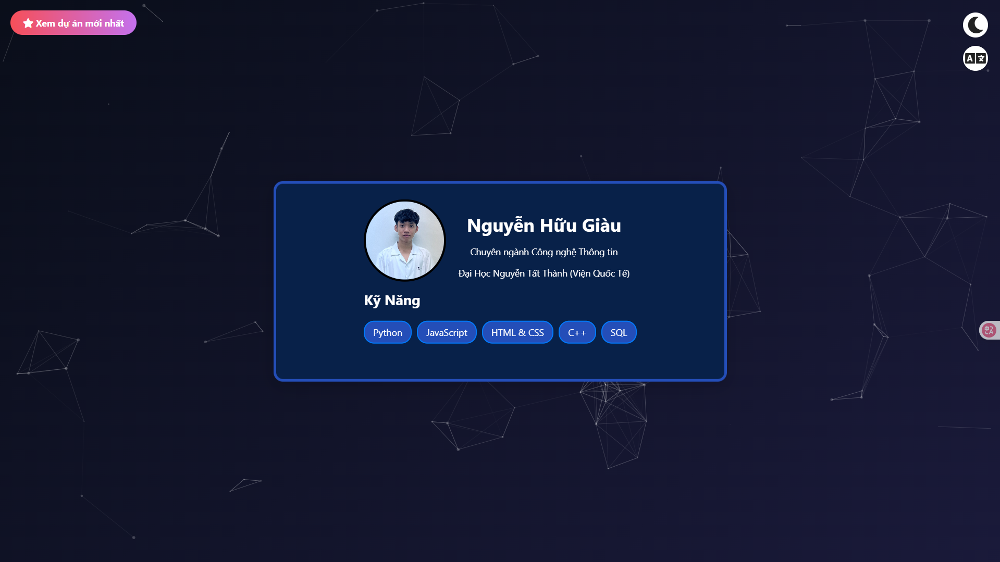

# 🚀 Nguyễn Hữu Giàu – Kiến tạo Trải nghiệm số

> Nơi những ý tưởng mã hóa trở thành hiện thực sống động. Khám phá hành trình và các dự án đột phá của tôi!

---

## ✨ Chào bạn, tôi là Giàu!

Chào mừng bạn đến với không gian số của tôi! Đây không chỉ là một **hồ sơ cá nhân (personal portfolio)** mà còn là cánh cửa để bạn khám phá **hành trình của một lập trình viên đầy đam mê**. Với giao diện được thiết kế tối giản nhưng mạnh mẽ, trang web này là nơi tôi chia sẻ những dự án tâm huyết, quá trình học hỏi không ngừng và những kỹ năng tôi đã tích lũy được.

Tôi xây dựng portfolio này với mong muốn tạo ra một trải nghiệm mượt mà, trực quan và ấn tượng, giúp bạn dễ dàng nắm bắt năng lực và tầm nhìn của tôi trong thế giới công nghệ. Hãy cùng khám phá!

---



---

## 🎯 Điều tôi theo đuổi

* **Kiến tạo giá trị:** Sử dụng code để giải quyết các vấn đề thực tế, tạo ra những giải pháp phần mềm có giá trị và ý nghĩa.
* **Kết nối tiềm năng:** Trở thành cầu nối giữa các ý tưởng và công nghệ, tìm kiếm cơ hội hợp tác và phát triển.
* **Trải nghiệm người dùng vượt trội:** Luôn đặt người dùng làm trung tâm, tối ưu hóa giao diện và tương tác để mang lại trải nghiệm tốt nhất.

---

## 🛠️ Công nghệ tôi làm chủ

| Thành phần           | Mô tả                                                                                                                  |
| :------------------- | :--------------------------------------------------------------------------------------------------------------------- |
| `HTML5`              | Xây dựng **cấu trúc nền tảng vững chắc** cho mọi dự án web, đảm bảo tính tương thích và SEO.                            |
| `CSS3`               | Thiết kế **giao diện bắt mắt, phản hồi nhanh** trên mọi thiết bị, cùng các hiệu ứng động mượt mà, nâng cao trải nghiệm người dùng. |
| `Vanilla JavaScript` | **Thổi hồn tương tác** vào trang web: từ logic phức tạp đến các hiệu ứng nhỏ, mọi thứ đều được điều khiển mượt mà và hiệu quả. |
| `Particles.js`       | Tạo điểm nhấn **thị giác độc đáo** với hiệu ứng hạt nền động, mang lại cảm giác hiện đại và cuốn hút.                   |
| `Font Awesome`       | Tích hợp **biểu tượng chuyên nghiệp**, giúp giao diện thân thiện, dễ hiểu và đẹp mắt hơn.                              |

---

## 🔥 Điểm chạm đặc biệt

* ✨ **Chuyển động 'Điện ảnh':** Trải nghiệm chuyển trang mượt mà như xem phim, với các hiệu ứng tinh tế khi cuộn hoặc dùng phím mũi tên.
* 🌐 **"Ngôn ngữ của bạn":** Hỗ trợ song ngữ (🇻🇳 Tiếng Việt & 🇺🇸 English), chuyển đổi tức thì giúp mọi người dễ dàng tiếp cận.
* 💡 **Giao diện "Đêm/Ngày":** Tùy chỉnh chế độ sáng/tối linh hoạt, bảo vệ mắt và tăng tính cá nhân hóa.
* 🌠 **Nền động "Vũ trụ":** Hiệu ứng hạt nền tương tác, tạo không gian ảo diệu và thu hút sự chú ý.
* 🔄 **"Chạm và Cảm nhận":** Các hiệu ứng chuyển động mượt mà khi di chuột, mang lại cảm giác sống động và tương tác.
* 💌 **Kết nối "Chỉ một chạm":** Tất cả thông tin liên hệ và mạng xã hội được tích hợp tiện lợi, giúp bạn dễ dàng kết nối với tôi.

---

## 📂 Tổ chức dự án

```bash
Root Folder/
├── Video - Picture/  # Thư mục lưu trữ hình ảnh demo và avatar, sẵn sàng cho video nếu cần!
│   └── Picture.jpg   # Ảnh chân dung của tôi
│   └── DEMO.png      # Ảnh minh họa ấn tượng cho README
├── index.html        # Trang HTML chính – "Bộ xương" của dự án
├── style.css         # "Linh hồn" CSS: tạo phong cách, màu sắc và hiệu ứng
├── script.js         # "Bộ não" JavaScript: điều khiển mọi tương tác và logic thông minh
├── particles.json    # Cấu hình "Vũ trụ" Particles.js của bạn
└── LICENSE           # Giấy phép - để bạn biết tôi chia sẻ dự án này như thế nào
```

## 🚀 Mở khóa trải nghiệm
### ✅ Cách 1: Khám phá cục bộ
Tải về: Kéo toàn bộ mã nguồn về máy tính của bạn.

Mở: Click đúp vào tệp index.html và khám phá ngay trong trình duyệt của bạn!

### ✅ Cách 2: Triển khai toàn cầu
Muốn đưa hồ sơ của bạn lên mạng? Rất đơn giản!

- GitHub Pages: Cách nhanh nhất để chia sẻ dự án trực tiếp từ kho GitHub của bạn.

- Netlify: Triển khai siêu tốc, tích hợp CI/CD và miễn phí HTTPS.

- Vercel: Nền tảng tuyệt vời cho frontend, tối ưu hóa hiệu suất và trải nghiệm phát triển.

## 🛡️ Giấy phép
Copyright (c) 2025 Nguyễn Hữu Giàu.

Dự án này được cấp phép dưới Giấy phép MIT. Điều đó có nghĩa là bạn có thể tự do sử dụng, chỉnh sửa và phân phối. Hãy xem tệp LICENSE để biết thêm chi tiết! Nếu bạn có ý tưởng cải thiện hoặc muốn cộng tác, đừng ngần ngại liên hệ nhé!

---

## 📬 Liên hệ
Tác giả: Nguyễn Hữu Giàu

-**Email**: HuuGiau2304@gmail.com

-**GitHub**: NgHuuGiau

-**Facebook**: HuuGiau.2304

-**Instagram**: nguyen_huugiau

-**X (Twitter)**: Nguyen_Huu_Giau

---

## 💡 Góc nhỏ chia sẻ:

- Tôi đang nỗ lực hết mình để tối ưu hóa trải nghiệm trên các thiết bị di động. Mục tiêu là mang lại sự hoàn hảo trên mọi màn hình. Hãy chờ đón những bản cập nhật tiếp theo nhé!

## ❗️ Lưu ý nhỏ:

- Hiện tại giao diện web có thể sẽ bị lỗi đối với mobile
