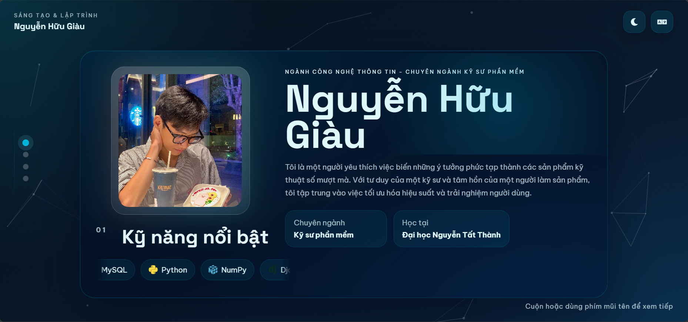

# 🚀 Nguyễn Hữu Giàu – Interactive Personal Portfolio 2026

> **Nơi nghệ thuật thị giác hòa quyện cùng tư duy lập trình.** Khám phá hành trình sáng tạo và những giải pháp công nghệ đột phá của tôi!

---

## ✨ Chào mừng đến với không gian số của tôi!

Đây không chỉ là một **Personal Portfolio** thông thường, mà là một trải nghiệm kỹ thuật số được thiết kế để kết nối ý tưởng với thực tế. Với phong cách **Dark Ocean** huyền bí và hiệu ứng **Bioluminescence** (ánh sáng sinh học), trang web này phản ánh tầm nhìn của tôi về một thế giới công nghệ mượt mà, trực quan và đầy cảm hứng.

Tại đây, bạn sẽ tìm thấy sự kết hợp giữa kỹ thuật phần mềm bài bản và niềm đam mê tối ưu hóa trải nghiệm người dùng. Hãy cùng tôi khám phá những cột mốc và dự án tâm huyết bên dưới!

---



---

## 🛠️ Hệ sinh thái công nghệ

| Thành phần | Công nghệ & Kỹ thuật |
| :--------- | :------------------- |
| **Frontend** | HTML5 Semantic, Vanilla CSS (Glassmorphism, Flexbox Grid) |
| **Interactions** | Vanilla JavaScript (ES6+), Multi-language Logic (i18n) |
| **Visual Effects** | Particles.js (Bioluminescent background), Tilt.js logic |
| **Aesthetics** | Dark/Light Mode, Custom Typography (Space Grotesk & Be Vietnam Pro) |
| **Icons** | Font Awesome 5, DevIcon |

---

## 🔥 Tính năng vượt trội

* 🎭 **Hiệu ứng "Cinematic":** Chuyển slide mượt mà với cảm giác điện ảnh, hỗ trợ cả cuộn chuột và phím mũi tên.
* 🌍 **Đa ngôn ngữ (VI/EN):** Hệ thống i18n thông minh cho phép chuyển đổi ngôn ngữ tức thì không cần tải lại trang.
* 🌗 **Chế độ Sáng/Tối:** Tối ưu hóa trải nghiệm thị giác với hai chủ đề: *Dark Ocean* sâu lắng và *Light Sky* trong trẻo.
* 🌌 **Tương tác Hạt (Particles):** Nền động tương tác theo con trỏ chuột, tạo không gian sống động và chuyên nghiệp.
* 📱 **Phản hồi linh hoạt:** Thiết kế tối ưu cho màn hình lớn và mang lại trải nghiệm đồng nhất.

---

## 📂 Dự án tiêu biểu (Featured Projects)

*   **[YOLO12 AI Vision System](https://github.com/NgHuuGiau/Project-Yolo-v12)**: 
    *   *AI / Python*
    *   Hệ thống nhận dạng đối tượng và phân tích cử chỉ tay thời gian thực, tối ưu hóa cho GPU NVIDIA.
*   **[SummarEase Django](https://github.com/NgHuuGiau/SummarEase-Django)**: 
    *   *Django / NLP / Python*
    *   Giải pháp thông minh giúp 'gạn đục khơi trong', trích xuất những tinh túy từ các văn bản dài.
*   **[Sudoku Game](https://github.com/NgHuuGiau/SUDOKU)**: 
    *   *Python / Algorithms*
    *   Trải nghiệm giải đố mượt mà dựa trên thuật toán Backtracking với giao diện trực quan.
*   **[Fashion Website](https://github.com/NgHuuGiau/Fashion-Website)**: 
    *   *Fullstack / Web Dev*
    *   Nền tảng thương mại điện tử mảng thời trang với kiến trúc hoàn chỉnh từ Frontend đến Backend.

---

## 📂 Cấu trúc mã nguồn

```bash
Personal_Profile/
├── Video-Picture/    # Tài nguyên hình ảnh, avatar và demo
├── index.html        # Cấu trúc nội dung chuẩn SEO & i18n
├── style.css         # Hệ thống Design System, hiệu ứng Glassmorphism & Themes
├── script.js         # Logic điều khiển Slide, Ngôn ngữ, Theme và Tương tác 3D
├── particles.json    # Cấu hình hiệu ứng hạt nền
└── LICENSE           # Giấy phép MIT
```

---

## 🚀 Cách sử dụng

1.  **Clone dự án**:
    ```bash
    git clone https://github.com/NgHuuGiau/Personal_Profile
    ```
2.  **Mở tệp**: Mở `index.html` bằng trình duyệt hoặc sử dụng *Live Server*.
3.  **Tùy chỉnh**: Cập nhật thông tin tại đối tượng `translations` trong tệp `script.js`.

---

## 📬 Kết nối với tôi

Tôi luôn sẵn sàng cho các cơ hội thực tập, cộng tác dự án và trao đổi kỹ thuật!

- 📧 **Email**: [HuuGiau2304@gmail.com](mailto:HuuGiau2304@gmail.com)
- 🐙 **GitHub**: [@NgHuuGiau](https://github.com/NgHuuGiau)
- 📘 **Facebook**: [HuuGiau.2304](https://www.facebook.com/HuuGiau.2304)
- 📸 **Instagram**: [@nguyen_huugiau](https://www.instagram.com/nguyen_huugiau/)
- 🐦 **X (Twitter)**: [@Nguyen_Huu_Giau](https://x.com/Nguyen_Huu_Giau)

---

## 🛡️ Giấy phép
Dự án được phát hành dưới giấy phép **MIT**.

Copyright © 2026 **Nguyễn Hữu Giàu**.
